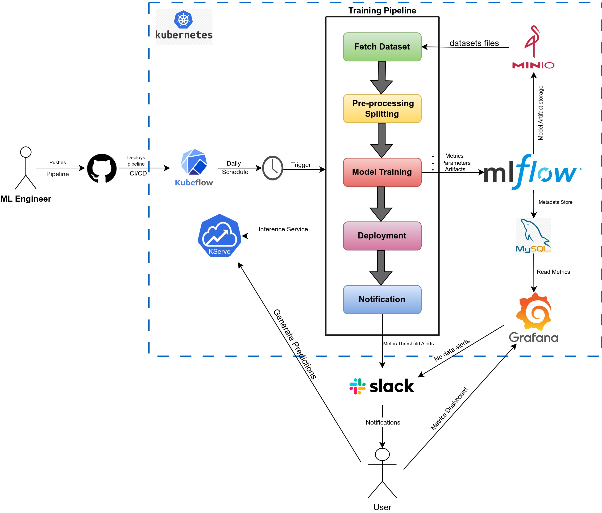
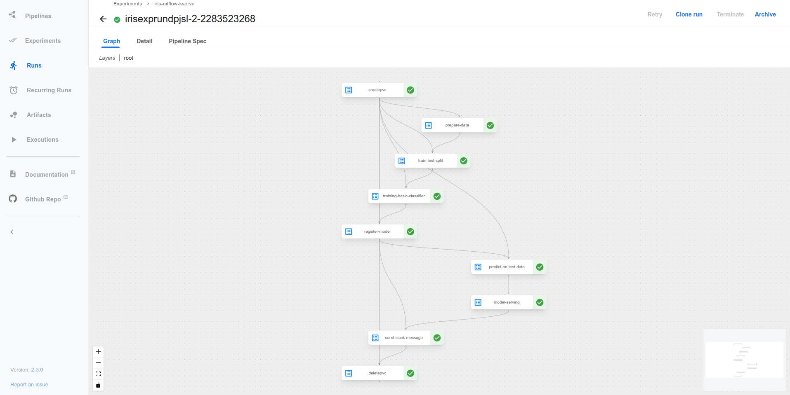
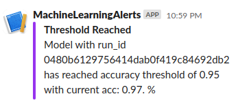
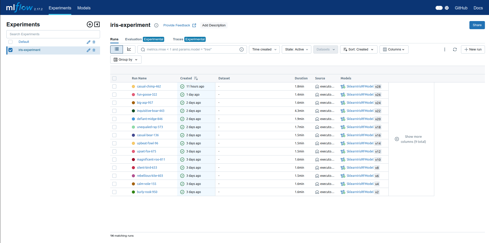
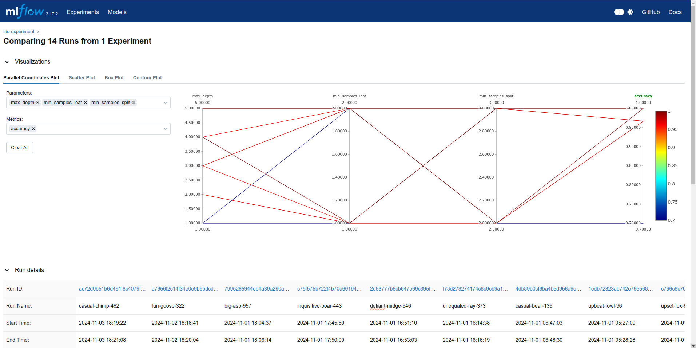
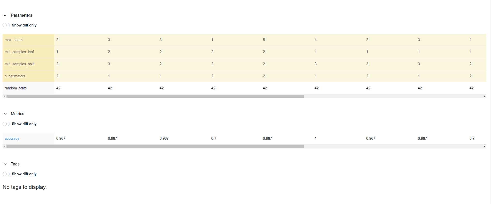
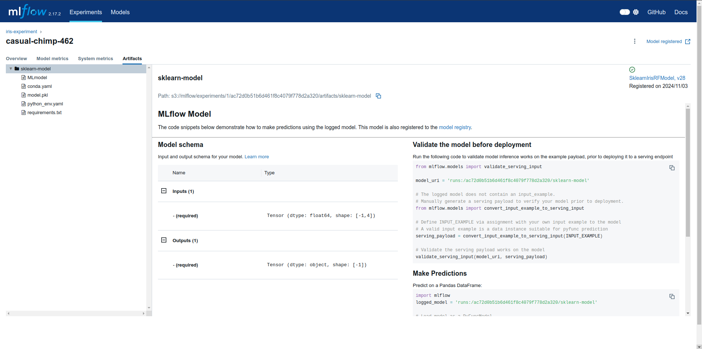
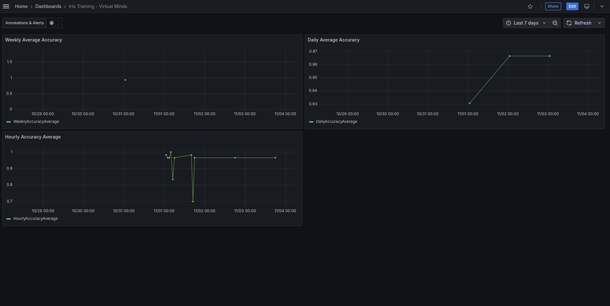
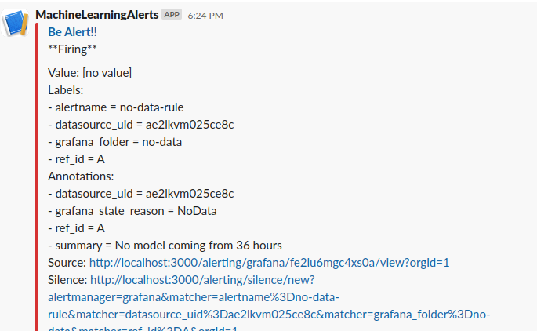

# MLOps Lifecycle Project

## Requirements

1. **Model Storage**: The trained model should be stored with a unique version, along with its hyperparameters and accuracy, in a storage solution like S3. This requires extending the Python script to persist this information.
2. **Scheduled Training**: The model should be trained daily, with a retry mechanism for failures and an SLA defined for the training process.
3. **Model Quality Monitoring**: Model accuracy should be tracked over time, with a dashboard displaying weekly average accuracy.
4. **Alerting**: Alerts should be configured for:
   - If the latest model was generated more than 36 hours ago.
   - If the model accuracy exceeds a predefined threshold.
5. **Model API Access**: The model should be accessible via an API for predictions. The API should pull the latest model version whenever available.

---

## Architecture Diagram
  

The architecture is designed to orchestrate the MLOps lifecycle across multiple components, as shown in the diagram.

## Component Descriptions

- **GitHub**: Repository for storing the source code of the machine learning pipeline. It supports CI/CD to deploy the pipeline to the target environment.
- **Kubernetes**: Container orchestrator that runs and manages all pipeline components.
- **Kubeflow**: Manages and schedules the machine learning pipeline, deployed on Kubernetes.
- **MLFlow**: Tracks experiments and serves as a model registry.
- **Minio**: S3-compatible object storage for training datasets and MLFlow model artifacts.
- **MySQL**: Backend database for MLFlow, storing information on experiments, runs, metrics, and parameters.
- **KServe**: Exposes the trained model as an API, allowing predictions at scale over Kubernetes.
- **Grafana**: Generates dashboards for accuracy metrics and manages alerting.
- **Slack**: Receives notifications for specific metrics and alerts when data is unavailable.

---

## System Workflow

1. **Pipeline Development**: An ML Engineer creates or modifies the training pipeline code in GitHub.
2. **CI/CD Deployment**: CI/CD tests the pipeline, and once cleared, deploys it to Kubeflow with a user-defined schedule.
3. **Pipeline Execution**:
   - The pipeline is triggered on schedule, initiating the sequence of tasks.
   - **Data Fetching**: Raw data is read from Minio.
   - **Preprocessing**: Data is preprocessed and split into training and validation/test sets.
   - **Model Training**: The model is trained, with hyperparameters, metrics, and model weights stored in MLFlow.
   - **Deployment**: The trained model is deployed via KServe, making it available as an API on Kubernetes.
   - **Notifications**: Slack notifications are triggered if pipeline metrics exceed defined thresholds (e.g., accuracy > 95%).
4. **Monitoring and Alerting**:
   - **Grafana Dashboard**: Utilizes MLFlow’s MySQL database to visualize metrics, such as model accuracy.
   - **Slack Alerts**: Alerts are sent to Slack if no model has been updated within the last 36 hours.

---

## Implementation Details

Although the assignment required implementing a single component, I explored the entire lifecycle components to meet most of the requirements. However, there are some limitations due to time and resource constraints:

- **CI/CD**: GitHub is shown in the architecture as the source and CI/CD provider, but it is not fully implemented here as my local resources could not connect with GitHub Actions (self-hosted runner setup was not used).
  
---

## Training Pipeline SLA Dimensions

These SLA dimensions represent potential enhancements that could further improve the pipeline’s reliability and performance:

- **Training Frequency**: Ideally, the pipeline should train the model daily to maintain relevance. Improved scheduling would enhance consistency.
- **Retry Mechanism**: Implementing retries for errors would improve resilience.
- **Execution Time Limits**: Adding maximum execution times for training runs would prevent long-running processes and increase efficiency.
- **Availability**: Regular model updates (e.g., every 24-36 hours) would improve reliability, with alerts for delayed runs providing faster issue resolution.
- **Alerting**: Alerts for accuracy deviations would aid in quicker troubleshooting.
- **Resource Usage**: Resource limits for CPU and memory would optimize system performance and prevent overuse.
- **Data Freshness**: Ensuring that input data is frequently updated would enhance model quality.
- **Enhanced Monitoring**: Tracking additional metrics like accuracy trends, execution times, and resource utilization would improve insight into pipeline performance.

These are aspirational improvements that would make the pipeline more robust and production-ready. The current implementation covers some aspects and could be improved if sufficient time and resources become available.


## Setup Guide

This guide provides detailed instructions for setting up an MLOps environment using Minikube, Kubeflow, MLflow, KServe, Minio, Grafana, and Slack for notifications. It covers prerequisites, environment setup, and necessary configurations to deploy and monitor a machine learning pipeline.

- This guide assumes you have a basic understanding of Kubernetes, Docker and Python.   
- Python3.8+ and Docker should be installed on your system before starting the guide.   
- Moreover, a Slack namespace is required with permissions to setup the App and Generate webhooks for Alerts setup.

## Pre-requisites

### Install Minikube
```bash
curl -LO https://storage.googleapis.com/minikube/releases/latest/minikube-linux-amd64
sudo install minikube-linux-amd64 /usr/local/bin/minikube && rm minikube-linux-amd64
# alteast 4 CPUs, 8GB RAM, and 40GB disk space
minikube start --cpus 4 --memory 8096 --disk-size=40g
```
Link `kubectl` from Minikube If it's not already installed:

```bash
sudo ln -s $(which minikube) /usr/local/bin/kubectl
```
Install `helm` if not already installed:

```bash
curl https://raw.githubusercontent.com/helm/helm/main/scripts/get-helm-3 | bash
```

## Kubeflow Setup 
 
1. **Install Kubeflow Pipelines** :

```bash
export PIPELINE_VERSION=2.3.0
kubectl apply -k "github.com/kubeflow/pipelines/manifests/kustomize/cluster-scoped-resources?ref=$PIPELINE_VERSION"
kubectl wait --for condition=established --timeout=60s crd/applications.app.k8s.io
kubectl apply -k "github.com/kubeflow/pipelines/manifests/kustomize/env/dev?ref=$PIPELINE_VERSION"
kubectl set env deployment/ml-pipeline-ui -n kubeflow DISABLE_GKE_METADATA=true
kubectl wait --for=condition=ready pod -l application-crd-id=kubeflow-pipelines --timeout=1000s -n kubeflow
# You can Ctr1+C if all pods except proxy-agent are running
```

> **Note** : Allow up to 20 minutes for all Kubeflow pods to be running. Verify the status:

```bash
kubectl get pods -n kubeflow
```
Ensure that all pods are running (except `proxy-agent`, which is not applicable to us as it serves as proxy for establishing connection to Google Cloud's SQL and uses GCP metadata).
 
2. **Expose the `ml-pipeline-ui` via NodePort** :

```bash
kubectl patch svc ml-pipeline-ui -n kubeflow --type='json' -p '[{"op":"replace","path":"/spec/type","value":"NodePort"}]'
minikube service ml-pipeline-ui -n kubeflow
```
Take note of the address to access `ml-pipeline-ui` as you’ll use it for pipeline setup.

## MLflow Setup 
 
1. **Build and Push MLflow with Mysql Docker Image to Dockerhub**  (Continue if your system is not `linux/amd64` architecture, otherwise skip this step as the default `syedshameersarwar/mlflow-mysql:v2.0.1` works for `linux/amd64`):

```bash
cd ./mlflow
docker build -t mlflow-mysql .
docker login
# create docker repository on docker hub for storing the image
docker tag mlflow-mysql:latest <dockerhub-username>/<docker-repository>:latest
docker push <dockerhub-username>/<docker-repository>:latest
# Make sure to update mlfow.yaml to reference the pushed image
```
 
2. **Deploy MLflow Components** :

```bash
kubectl create ns mlflow
kubectl apply -f pvc.yaml -n mlflow
# Update secret.yaml with desired base64-encoded MySQL and Minio credentials, defaults are provided in the file
kubectl apply -f secret.yaml -n mlflow
kubectl apply -f minio.yaml -n mlflow
kubectl apply -f mysql.yaml -n mlflow
# Check if MySQL and Minio pods are running
kubectl get pods -n mlflow
# if all pods are running, proceed to the next step
kubectl apply -f mlflow.yaml -n mlflow
```

> **Verify Deployment** : Check if MLflow pod is running.

```bash
kubectl get pods -n mlflow
```
 
3. **Expose MLflow Service via Minikube** :

```bash
minikube service mlflow-svc -n mlflow
```

Note the address to access MLflow UI.

## KServe Setup 
 
1. **Clone and Install KServe** :

```bash
cd ..
git clone https://github.com/kserve/kserve.git
cd kserve
./hack/quick_install.sh
```

> **Verify Installation** : Check all necessary pods:

```bash
kubectl get pods -n kserve
kubectl get pods -n knative-serving
kubectl get pods -n istio-system
kubectl get pods -n cert-manager
# if all pods are running, go back to the root directory
cd ..
```
 
2. **Configure Service Account and Cluster Role** : 
  - Copy Minio credentials (`base64-encoded`) from MLflows `secret.yaml` to `sa/kserve-mlflow-sa.yaml`.   
    -  The `user` field will populate `AWS_ACCESS_KEY_ID` in `sa/kserve-mlflow-sa.yaml`.  
    - The `secretkey` field will populate `AWS_SECRET_ACCESS_KEY` in `sa/kserve-mlflow-sa.yaml`.  
    - Leave the `region` field as it is. (base64 encoded for `us-east-1`).


  - Apply the service account and cluster role:


```bash
# allow kserve to access Minio
kubectl apply -f sa/kserve-mlflow-sa.yaml
# allow Kubeflow to access kserve and create inferenceservices
kubectl apply -f sa/kserve-kubeflow-clusterrole.yaml
```

## Minio Bucket Creation 
 
1. **Port-forward Minio UI** :

```bash
kubectl port-forward svc/minio-ui -n mlflow 9001:9001
```
 
2. **Login and Create Buckets**  
- Access [localhost:9001](http://localhost:9001/)  with credentials (`base64-decoded`) you setup in `secret.yaml` of `MLFlow` and create two buckets: 
  - **data**
 
  - **mlflow**
- Then, navigate to **Object Browser -> mlflow -> Create**  a new path called `experiments`.
- Now upload the `iris.csv` dataset to the `data` bucket.
- You can close the port-forwarding once done by pressing `Ctrl+C`.

## Slack Notifications 
 
1. **Create a Slack App**  for notifications: 
  - Follow the [Slack API Quickstart Guide](https://api.slack.com/quickstart)  and obtain a webhook URL for your Slack workspace. (You can skip `invite` part of step 3 and step 4 entirely).
 
  - Test with `curl` as shown in the Slack setup guide.

## Pipeline Compilation and Setup 
 
1. **Compile Pipeline** :

```bash
# Create a python virtual environment for pipeline compilation
mkdir src
cd src
python3 -m venv env
source env/bin/activate
pip install kfp[kubernetes]
```
 
  - Create a `pipeline.py` file in this directory and include the contents from `src/pipeline.py`.
 
  - Update the Slack `webhook_url` on line `#336` in `pipeline.py`.
 
2. **Generate Pipeline YAML** :

```bash
python3 pipeline.py
# deactivate the virtual env after pipeline generation
deactivate
```

> The generated file `iris_mlflow_kserve_pipeline.yaml` is now ready for upload to Kubeflow.
 
3. **Upload and Schedule Pipeline in Kubeflow** : 
  - Visit the `ml-pipeline-ui` address from `Kubeflow` setup and Click on **Upload Pipeline**.
  - Give pipeline a name (e.g., `IrisExp`), just make sure its small as I faced an issue for large name where `Kubeflow` was not able to read pod information due to large pod names.
  - Upload the generated `iris_mlflow_kserve_pipeline.yaml` file.
 
  - Go to **Experiments -> Create New Experiment**  and name it `iris-mlflow-kserve`.
 
  - Configure a recurring run : 
    - Goto `Recurring Runs` -> `Creating Recurring Run` -> `Select Pipeline created from above`
    - Make sure to give a small name for `Recurring run config` due to the same issue as mentioned above.
    - Select the `iris-mlflow-kserve` experiment.
    - Setup `Run Type` and `Run Trigger` details as mentioned below: 
      - **Run Type** : `Recurring`
  
      - **Trigger Type** : Periodic, `every 1 day`, Maximum concurrent runs: `1`, Catchup: `False`.
  
      - **Run Parameters** : `data_path: /data`
  - Click **Start** and the pipeline will run daily starting from the next day at the time of run creation.

> **You can also manually trigger a one-off run for testing purposes.**
  - Follow the same steps as above but select **Run Type** as `One-off` and click **Start**.
  - This will trigger the pipeline immediately. You can monitor the pipeline in the  `Runs`  tab.
  - 
  - 


## Model Inference 
 
1. **After succesfull pipeline exection, you can get API Endpoint for Inference** :

```bash
kubectl get inferenceservice -n kubeflow
```
* Note the service name and URL host.
 
2. **Make Prediction Request** :
Create an `input.json` file with the following content:

```json
{
  "instances": [
    [6.8, 2.8, 4.8, 1.4],
    [5.1, 3.5, 1.4, 0.2],
    [6.0, 3.4, 4.5, 1.6],
    [4.8, 3.4, 1.6, 0.2]
  ]
}
```
3. Use `curl` to send the request:

```bash
export INGRESS_HOST=$(minikube ip)
export INGRESS_PORT=$(kubectl -n istio-system get service istio-ingressgateway -o jsonpath='{.spec.ports[?(@.name=="http2")].nodePort}')
export INF_SERVICE_NAME=<inference-service-name>
export INF_SERVICE_HOST=<inference-service-host>
curl -H "Host:${INF_SERVICE_HOST}" -H "Content-Type: application/json" "http://${INGRESS_HOST}:${INGRESS_PORT}/v1/models/${INF_SERVICE_NAME}:predict" -d @./input.json
```
* You should see the predictions for the input data.  

**You can also visit MLflow UI to see the model versions and experiment details with metrics, hyperparameters, and artifacts.**
  

  

  




## Grafana Setup for Monitoring and Alerts 
 *Grafana is used to setup the dashboard for monitoring accuracy metric trends on hourly, daily, and weekly basis. Moreover, no data alerts are configured to notify if no new models are trained in 36 hours.*
1. **Deploy Grafana** :
```bash
# move to the root directory if not already
cd ..
cd grafana
kubectl create ns grafana
kubectl apply -f grafana.yaml -n grafana
# Check if Grafana pod is running
kubectl get pods -n grafana
# if pod is running, expose the service
minikube service grafana -n grafana
```
2. **Login to Grafana with default credentials (admin/admin)** and change the password if you want.
3. **Set Up MySQL as Data Source** : 
  - Go to **Connections -> Data Sources -> Add data source -> MySQL**  and configure with MySQL credentials (`base64-decoded)` from `secret.yaml` of `MLFlow`.    
    - **Host** : `mysql-svc.mlflow:3306`
  
    - **Database** : `<database> in secret.yaml (mysql-secrets) during mlflow setup (default: mlflowdb)`

    - **User**:  `<username> in secret.yaml (mysql-secrets) during mlflow setup (default: admin)`

    - **Password**: `<password> in secret.yaml (mysql-secrets) during mlflow setup (default: vIRtUaLMinDs)`
  - Save and Test the connection.
  


 
### Add Dashboard for Accuracy Metrics

1. **Import the Dashboard**:
   - Navigate to **Dashboards** -> **New** -> **Import**.
   - Upload the file `accuracy_metrics.json` from `grafana/`.
   - Optionally, change the dashboard name.
   - Select the MySQL datasource created in previous steps.
   - Click **Import** to make the dashboard visible.

### Set Up Alerts in Grafana

1. **Create a Slack Contact Point**:
   - Navigate to **Alerting** -> **Contact points** -> **Create contact point**.
   - Provide a descriptive name for the contact point.
   - Under **Integration**, select **Slack** and enter the webhook URL obtained during Slack setup.
   - Test the configuration to ensure the Slack notification works.
   - Click **Save**.

2. **Create an Alert Rule**:
   - Navigate to **Alerting** -> **Alert Rules** -> **New Alert Rule**.
   - Provide a name for the rule, such as **Iris No Data Alert**.
   - Under **Define query**, select **Code** instead of **Query Builder**, and enter the following SQL query:
     ```sql
     select COUNT(m.timestamp) as recordcount 
     FROM experiments as e 
     INNER JOIN runs as r ON r.experiment_id = e.experiment_id 
     INNER JOIN metrics as m ON r.run_uuid = m.run_uuid 
     where e.name = 'iris-experiment' 
     HAVING MAX(FROM_UNIXTIME(m.timestamp/1000)) > DATE_ADD(NOW(), INTERVAL -36 HOUR);
     ```
   - In **Rule Type -> Expressions**, delete the default expressions and add a new **Threshold** expression.
     - Set the alert condition: **WHEN Input A IS BELOW 1**.
   - Click **Preview** to verify:
     - The status should be **Normal** if a new model run has occurred within the last 36 hours, otherwise it will show **Alert**.

3. **Configure Evaluation Behavior**:
   - Create a new folder named **no-data**.
   - Create an evaluation group named **no-data** with an evaluation interval of **5 minutes**.
   - Set **Pending period** to **None**.
   - Under **No data and error handling**:
     - Select **Alerting** for **Alert state if no data or all values are null**.
     - Select **Normal** for **Alert state if execution error or timeout**.

4. **Configure Labels and Notifications**:
   - Add the Slack contact point created earlier under **Label and Notifications**.
   - Provide a summary and description for the notification message.

5. **Save and Exit**:
   - Save the rule to complete the setup.

#### Expected Outcome
- You should receive a Slack notification if no model has been trained and registered within the last 36 hours in the experiment **iris-experiment**.
- The Grafana dashboard also provides insights into the average accuracy metrics over different periods. While the current pipeline runs daily, this setup would offer useful insights if the training frequency changes, including hourly, daily, or weekly trends.
  

  


## Limitations and Alternatives

1. **Retry Issue**: Although retries are configured, a known issue with Kubeflow (issue [#11288](https://github.com/kubeflow/pipelines/issues/11288)) prevents it from working as expected. Alternatives such as Apache Airflow or VertexAI could address this limitation.
2. **Single-Environment Setup**: The current setup operates in a single environment, lacking the flexibility of development, staging, and production environments.
3. **Manual Intervention**: There is no manual review process before deploying a model to production, which may be beneficial. Alternatives like Apache Airflow’s custom sensors could allow manual interventions.
4. **Kubernetes Dependency**: As a fully Kubernetes-native system, each pipeline component runs as a pod. This design is suitable for high-resource nodes but may not work well in low-resource environments.
5. **Additional Considerations**: Code readability, testability, scalability, GPU node scheduling, distributed training, and resource optimization are important aspects to consider for long-term scalability and robustness.

### Cleanup
```bash
minikube stop
minikube delete
```
## Conclusion
This guide provides a comprehensive setup for an MLOps lifecycle, covering model training, monitoring, alerting, and API deployment. While the implementation is limited by time and resource constraints, it offers a solid foundation for a production-ready MLOps environment. The architecture diagram, system workflow, and SLA dimensions provide a clear understanding of the system’s components and requirements. By following the setup guide, users can deploy and monitor the machine learning pipeline, track model accuracy, and receive alerts for critical metrics. The guide also highlights potential enhancements and alternative solutions to address limitations and improve the system’s reliability and performance.
